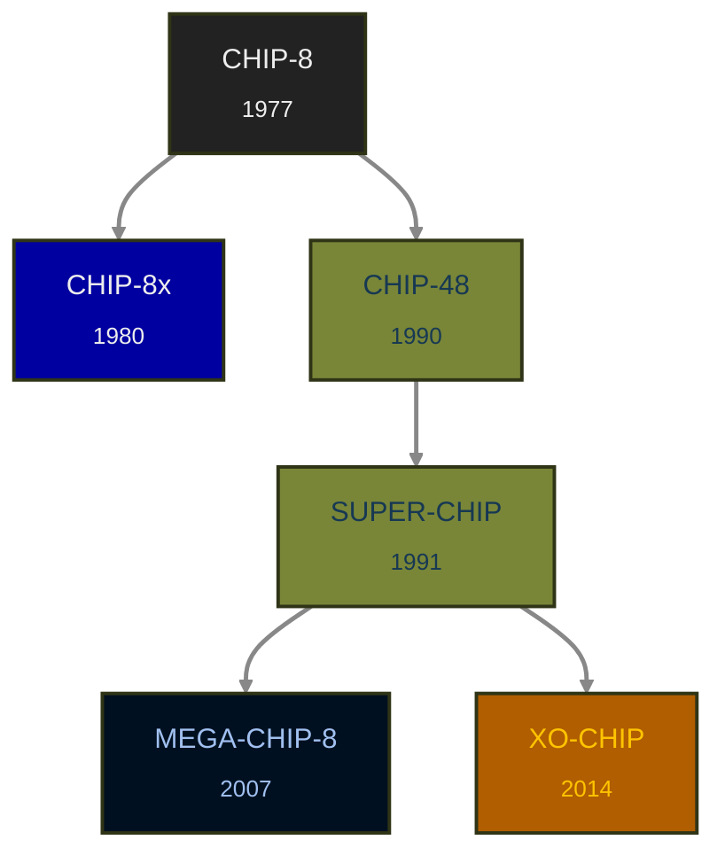

+++
date = '2026-02-03T07:32:10+01:00'
title = 'Variants'
weight = 10
+++

# CHIP-8 Variants in this Reference

> [!WARNING]
> This is an early work in progress, the pages for all but CHIP-8 are basically empty until the main structure
> of the CHIP-8 reference is in place. The others should follow that same structure, so writing them in parallel would
> be annoying on any structural rework.

## The CHIP-8 Family Tree

_The boxes of documented variants are clickable to jump to the respective page._

## TLDR?
The TLDR section links below lead to a list of the the concentrated 
differences to classic CHIP-8. If you know your classic CHIP-8, then
this will be a quicker way of getting all relevant changes.

> [!NOTE]
> **NOTE:** I started by writing the TLDR sections for the derived variants,
> but they will get a full stand-alone reference part as well, once
> the structure is in place. I see the TLDR sections as the MVP
> to get the knowledge base usable quickly and have time to write
> each stand-alone reference.

* **[Generic Classic CHIP-8](classic-chip-8)** \
  compatible to the original by Joseph Weisbecker in 1977 for the COSMAC VIP
* **[CHIP-48](chip-48)** [[TLDR](/reference/variants/chip-48/#tldr-what-is-different-to-chip-8)]\
  initial version of CHIP-8 on HP-48 family calculators, by Andreas Gustafsson, 1990
* **[SUPER-CHIP](super-chip)** [[TLDR](/reference/variants/superchip/#tldr-what-is-different-to-chip-8)]\
  an expansion of CHIP-48 for the HP-48SX with 128x64 hires mode by Erik Bryntse, 1991
* **[MEGA-CHIP-8](megachip8)** [[TLDR](/reference/variants/megachip8/#tldr-what-is-different-to-chip-8)]\
  a colorful demo scene oriented CHIP-8 extension by Martijn Wanting, Revival-Studios, 2007
* **[XO-CHIP](xo-chip)** [[TLDR](/reference/variants/xo-chip/#tldr-what-is-different-to-chip-8)]\
  a modern extension to SUPER-CHIP supporting colors and actual sound, first implemented in Octo by John Earnest, 2014

Expect the list to grow, as more variants are added. My plan is to add every variant I implemented emulation for,
and thus feel qualified to document them.